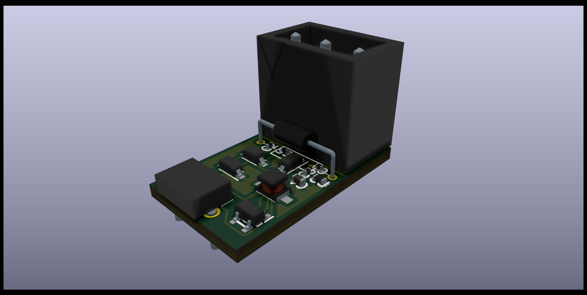
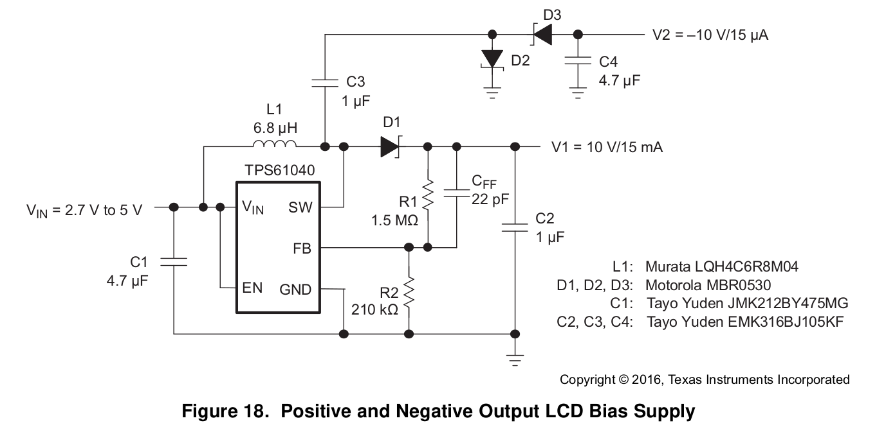

# 5V_to_everything

Convert *5V (from microUSB)* to various *positive and negative voltages* (for **small currents** only) at low cost with the TPS61040.

## Low cost version

### Setting and Usage

Most smartphone chargers can convert 220VAC to 5VDC. With this "5V_to_every" converter, electronic engineers can easily get a positive and negative voltage source, which has an **output voltage from ±5V to ±24V** using their smartphone chargers.

The basic idea comes from [datasheet of TPS61040](https://www.ti.com/lit/ds/symlink/tps61040.pdf). The output voltage can configured by changing the ratio of R1 to R2. In my design, R2 is 1kΩ SMD resistor and R1 can be easily replaced with a suitable resistor accourding to the calculation:

V_out = 1.233V × (1 + R1/R2) 

(V+ = V_out; V- = -V_out)

(range of V_out: 5V~24V)

For example, if you want a ±10V voltage source:

10 = 1.233 × (1 + R1/1000)

→ R1 = 7110 [Ω]

That means you should replace R1 with a 7.1kΩ resistor.

I also recommend you to replace R1 with a **potentiometer (20kΩ)**, so you can adjust the output voltage directly by hand, and reuse this voltage source in different projects, even when they demand different voltages.

## Planned versions

- Minimum size version with microUSB
- Minimum size version with typeC
